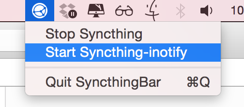

# SyncthingBar

Tiny OS X GUI wrapper for Homebrew installations of Syncthing and Syncthing-inotify.

## Screenshots

SyncthingBar menu allows you to stop and to start Syncthing and Syncthing-inotify:  

## Requirements

Homebrew installations of Syncthing and Syncthing-inotify.

## Version history

### 0.1.0

- Initial release.
